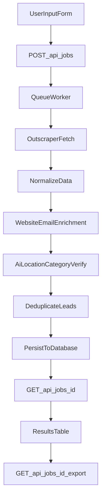

# Next.js Lead Extraction Automation Plan

## Goal

Deliver an interview-ready web app where users input business category + location, start an async extraction job, and receive a clean verified lead list with CSV export.

## Scope and Architecture

- Build a Next.js App Router project with React UI for job submission and results.
- Use Outscraper API as the extraction provider.
- Run extraction/cleaning in an async worker queue to support long-running jobs.
- Persist jobs and leads in Postgres via Prisma.
- Use OpenAI for AI-assisted validation (location/category relevance).

## Implementation Steps

1. Initialize app foundation and dependencies.
2. Define DB schema for jobs, raw leads, cleaned leads, and verification metadata.
3. Implement job creation/status/export API routes.
4. Add queue processor that orchestrates extract -> enrich -> verify -> dedupe pipeline.
5. Build React UI: input form, progress/status, final leads table, CSV download.
6. Add validation, error handling, retries, and rate-limit-safe fetching.
7. Add README with setup, env vars, assumptions, and evaluation notes.

## Key Files to Create

- [app/page.tsx](app/page.tsx) - Input form + run history + result view.
- [app/api/jobs/route.ts](app/api/jobs/route.ts) - Create/list jobs.
- [app/api/jobs/[id]/route.ts](app/api/jobs/[id]/route.ts) - Job detail + progress.
- [app/api/jobs/[id]/export/route.ts](app/api/jobs/[id]/export/route.ts) - CSV export endpoint.
- [lib/queue.ts](lib/queue.ts) - Queue setup and job producer.
- [workers/processLeadJob.ts](workers/processLeadJob.ts) - Main orchestration worker.
- [lib/extractors/outscraper.ts](lib/extractors/outscraper.ts) - Outscraper API adapter.
- [lib/enrichment/emailFinder.ts](lib/enrichment/emailFinder.ts) - Email scraping from business websites.
- [lib/cleaning/verifyLead.ts](lib/cleaning/verifyLead.ts) - Rule+AI category/location checks.
- [lib/cleaning/dedupe.ts](lib/cleaning/dedupe.ts) - Place-id and fuzzy deduplication.
- [lib/csv.ts](lib/csv.ts) - Export formatting.
- [prisma/schema.prisma](prisma/schema.prisma) - Job/lead models.
- [.env.example](.env.example) - Required environment variables.
- [README.md](README.md) - Setup, run, design decisions.

## Data Model (high-level)

- `LeadJob`: id, category, location, status, counts, timestamps, error.
- `RawLead`: provider payload snapshot linked to `LeadJob`.
- `Lead`: normalized output fields + verification flags + dedupe markers.
- `Lead` core columns: businessName, address, website, phone, email, mapsCategory, locationVerified, categoryVerified, finalStatus, rejectionReason, sourceUrl.

## Verification and Cleaning Rules

- Location verification:
  - Match target area against normalized address tokens.
  - Optionally geocode and compare city/postcode if ambiguous.
- Category verification:
  - Exact/alias match against known category synonyms first.
  - LLM tie-break when rule confidence is low.
- Dedupe strategy:
  - Primary: external place id.
  - Secondary: normalized name + phone.
  - Tertiary: fuzzy name + address similarity threshold.
- Irrelevant filtering:
  - Remove closed businesses, non-local listings, and category-mismatched records.

## Operational Details

- Queue: BullMQ + Redis for background processing and progress updates.
- Resilience:
  - Retry transient API/network failures.
  - Mark partial runs and keep failure reason for transparency.
- Security:
  - Keep API keys server-side only.
  - Validate all incoming payloads with Zod.

## Acceptance Criteria

- User can submit category + location and receive a job id.
- UI displays live progress and final counts (raw, deduped, accepted, rejected).
- Final output contains required fields: name, address, website, phone, email (if found).
- Leads are filtered for requested area/category and deduplicated.
- CSV export downloads the cleaned verified list.
- README explains assumptions, limitations, and how to run locally.

## Delivery Notes for Interview

- Include a short “before vs after cleaning” metric block in UI/README.
- Document data-source limitation (public email availability varies).
- Keep code modular so provider can be swapped later (Outscraper -> Places API).

